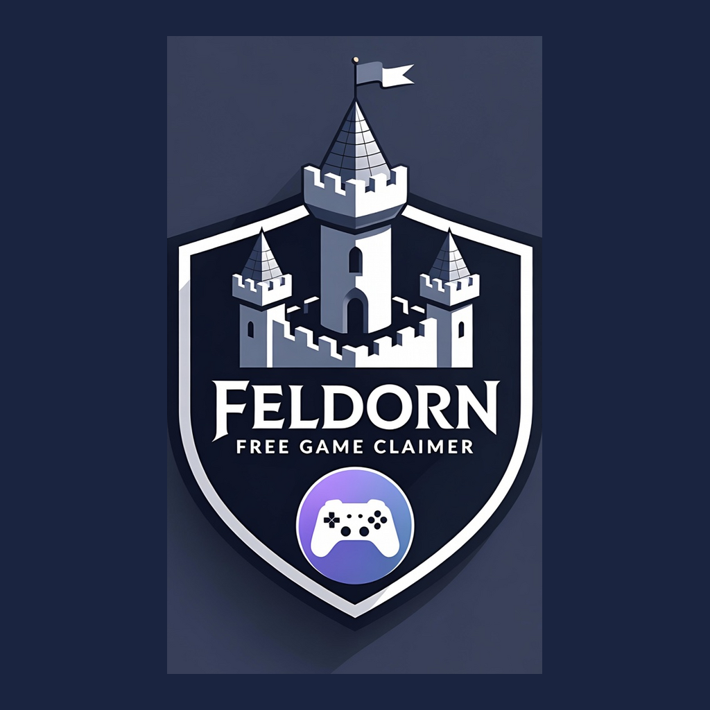
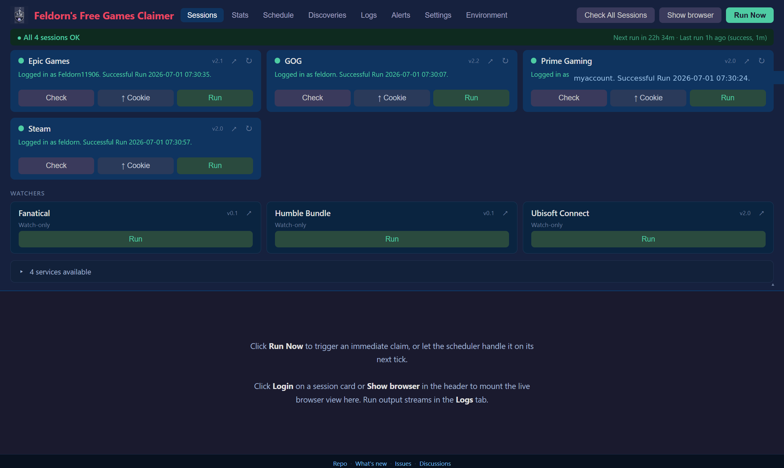

# Feldorn's Free Games Claimer

<p align="center">

</p>

A self-hosted scheduler that claims free games and rewards across multiple storefronts on its own. Logs in once via your browser session, then keeps watch — daily checks, captcha-aware pause-and-notify when a human is needed, in-app stats showing what got claimed, what's pending, and how your Microsoft Rewards points are trending.

Discovery isn't limited to each store's own free-game feed — the panel cross-references community aggregators ([gamerpower.com](https://www.gamerpower.com/) and [r/FreeGameFindings](https://www.reddit.com/r/FreeGameFindings/)) and picks up launch-day indie promos and storefront-side mystery drops that the first-party feeds miss.

Originally derived from [vogler/free-games-claimer](https://github.com/vogler/free-games-claimer) (dev branch). The control panel, in-app settings UI, claim-history stats, scheduler with hot-reload, AliExpress reintegration, captcha pause + manual-solve handoff, the Steam discovery migration, the Microsoft Rewards collector, the FAB asset claimer, and the Ubisoft / Humble / Fanatical / Lenovo watchers are all additions in this fork. Per-release changes are tracked in [CHANGELOG.md](CHANGELOG.md); [MODIFICATIONS.md](MODIFICATIONS.md) holds a frozen v2.4 snapshot of the diff vs. upstream for historical context.

Services are grouped by what they actually do.

**Claimers** — log in once, then auto-claim any free game that drops:

| Service | Notes |
|---|---|
|  [Amazon Prime Gaming](https://gaming.amazon.com) | Free games + GOG / MS Store / Xbox keys delivered via Prime |
|  [Epic Games Store](https://www.epicgames.com/store/free-games) | Weekly free-game claim |
|  [GOG](https://www.gog.com) | Homepage giveaways + catalog watch for tag-flagged free items. 2FA-enabled accounts can paste `GOG_OTP_BACKUP_CODES` to auto-consume backup codes on prompt. |
|  [Steam](https://store.steampowered.com) | Free-to-keep promotions only (not F2P or free weekends) |
| 🎨 [FAB](https://www.fab.com/limited-time-free) | Monthly Limited-Time Free 3D assets on Epic's content marketplace. Reuses your Epic Games session via SSO — no second login. *(opt-in, default off)* |

> **Discovery via community aggregators.** Epic and Steam claim eligible games surfaced by [gamerpower.com](https://www.gamerpower.com/) or [r/FreeGameFindings](https://www.reddit.com/r/FreeGameFindings/) that don't show up in the storefront's own feed. GOG entries from the same aggregators surface as notify-only items so you can claim them through the panel's noVNC view. See the [Discoveries tab](docs/PANEL.md#discoveries-tab) for the live list with AUTO / NOTIFY / CLAIMED / SKIP / MANUAL badges.

**Point / coin collectors** — daily-cadence reward grinding:

| Service | Notes |
|---|---|
| 🎯 [Microsoft Rewards](https://rewards.bing.com) | Daily Bing searches + activity cards for points, with before/after balance tracking |
| 🛒 [AliExpress](https://m.aliexpress.com) | Daily check-in coins *(opt-in; disabled by default; **deprecated** — see [Bot detection](docs/REFERENCE.md#bot-detection--what-works-what-doesnt))* |

**Watchers** — notify-only; surface new free items so you can grab them yourself:

| Service | Notes |
|---|---|
| 🎮 [Ubisoft Connect](https://store.ubisoft.com/us/free-games) | Pings on new free-week promos *(opt-in)* |
| 📦 [Humble Bundle](https://www.humblebundle.com/store) | Pings on new free items in the Humble store *(opt-in)* |
| 🔑 [Fanatical](https://www.fanatical.com/en/free-games-keys) | Pings on new free Steam-key giveaways *(opt-in)* |
| 🚀 [Lenovo Gaming Key Drops](https://gaming.lenovo.com/game-key-drops) | Tracks scheduled drops + fires push notifications **1h before / 5min before / at drop time** so you can land the queue before keys run out *(opt-in)* |

> **Why notify-only?** These storefronts have *dynamic* claim flows — newsletter prompts, region acks, "are you sure" modals, and other gates that the sites add and remove without notice — so any scripted claim path is brittle and silently breaks. Some also chain through multiple sites with one-shot vouchers (Lenovo → GamesPlanet → Steam), where a flaky auto-claim wastes the only attempt. Watchers detect *what's available* reliably; the actual grab is left to you, where a human can shrug off a UI change the script can't.

Uses [patchright](https://github.com/nicbarker/patchright) (Chromium with built-in anti-detection). Runs in Docker with a virtual display and VNC access — solve captchas, MFA, and one-time logins through the embedded noVNC viewer in the panel.

<p align="center">
<a href="assets/panel-sessions.png" target="_blank"></a>
<br/>
<em>Control panel — Sessions tab. Click for full size.</em>
</p>

---

## Features at a glance

- **Always-on control panel** at `http://localhost:7080` — log in via embedded noVNC, check session health, trigger Run Now, edit settings in-app.
- **Two-track scheduler** with hot-reload — main claim chain on its own cadence, Microsoft Rewards on a separate random-window schedule so its 30-45 min run doesn't block the rest.
- **Discoveries aggregator** — live view of [gamerpower.com](https://www.gamerpower.com/) + [r/FreeGameFindings](https://www.reddit.com/r/FreeGameFindings/) listings, badged against your auto-claim coverage (AUTO / CLAIMED / NOTIFY / SKIP / MANUAL).
- **Captcha pause** — when a script can't solve a challenge, it pauses for 10 min, fires a deep-link push notification, and resumes when you solve it via noVNC.
- **Run history** — last 200 runs persisted with full log buffers and summary counters, browsable from the Logs tab.
- **Cookie upload** — fallback when in-container login is fingerprint-blocked: paste a JSON cookie export from your desktop browser and the panel imports the session.
- **Settings UI** — every `src/config.js` flag editable from the panel, with env-var precedence and revert-to-env for any field.
- **Stats tab** — KPI tiles, per-service tables, 30-day chart, recent claims, Microsoft Rewards balance trend.
- **Alerts tab** — single place to see everything that needs your attention: pending manual code redemptions (Prime Gaming + Steam) with Mark redeemed / Dismiss actions, stale-session warnings with one-click re-login, a pointer to unread items in Discoveries, and the diagnostics banner's error-share flow. Each section hides itself when empty, so a healthy run leaves the tab visibly blank.
- **Diagnostics banner** — when a run crashes, the panel surfaces a one-click *Share to GitHub* button that opens a pre-filled issue with the error fingerprinted, log context captured (last 25+ lines around the failure), and a config snapshot (scheduler mode, active services, per-service flags, Node/`LANG`/`TZ`) attached. Sensitive values (apprise webhooks, embedded credentials) are redacted before submission; nothing is sent without your explicit click.
- **Cron / Sablier ready** — `RUN_ON_STARTUP=2` one-shot mode for scale-to-zero deployments.
- **Reverse-proxy aware** — subdomain, split-subdomain, and subfolder shapes all supported.

---

## Screenshots tour

| | |
|---|---|
| [Sessions tab](assets/panel-sessions.png) | Per-site login cards with status dots, Run buttons, and Cookie-upload fallback. |
| [Show browser](assets/panel-show-browser.png) | Embedded noVNC view of an active claim run with cards collapsed to mini-tiles. |
| [Stats tab](assets/panel-stats.png) | KPI tiles, per-service table, 30-day chart, recent claims list. |
| [Schedule tab](assets/panel-schedule.png) | Next-run wall times, intervals, last-run status — separate rows for Claimers and MS Rewards. |
| [Discoveries tab](assets/panel-discoveries.png) | Community aggregator listings with coverage badges (AUTO / CLAIMED / NOTIFY / SKIP / MANUAL). |
| [Settings tab](assets/panel-settings.png) | Services accordion with per-service flags and a sticky save footer. |

---

## Quick Start (Docker)

```sh
docker run --rm -it -p 6080:6080 -p 7080:7080 -v fgc:/fgc/data --pull=always ghcr.io/feldorn/free-games-claimer
```

Open the control panel at **http://localhost:7080**. On first run, click **Login** for each site to log in via the embedded noVNC browser, then either click **Run Now** or set `LOOP` (and optionally `START_TIME`) so the built-in scheduler fires daily on its own. Sessions persist across container restarts in the `fgc` volume.

Full details — Docker Compose, bare-metal Node, non-root mode — in [docs/INSTALL.md](docs/INSTALL.md).

---

## Documentation

- **[docs/INSTALL.md](docs/INSTALL.md)** — Docker, Docker Compose, bare-metal Node, and non-root (PUID/PGID) mode.
- **[docs/CONFIGURATION.md](docs/CONFIGURATION.md)** — Environment variables, per-store credentials, notifications, and the two-track scheduler.
- **[docs/PANEL.md](docs/PANEL.md)** — Walkthrough of every panel tab and the in-app Settings reference.
- **[docs/AUTH.md](docs/AUTH.md)** — Automatic login with 2FA, cookie upload, and the captcha-pause helper.
- **[docs/NETWORKING.md](docs/NETWORKING.md)** — Reverse-proxy setups (subdomain, split-subdomain, subfolder) with SWAG / NPM examples.
- **[docs/REFERENCE.md](docs/REFERENCE.md)** — Bot detection posture, data storage layout, HTTP API, and troubleshooting.
- **[docs/HOMEASSISTANT.md](docs/HOMEASSISTANT.md)** — Home Assistant REST-sensor integration with example template sensors, binary sensors, and automations.

---

## Release notes

Per-release changes are in **[CHANGELOG.md](CHANGELOG.md)** — what landed in each version, most recent first.

---

## Credits

Based on [vogler/free-games-claimer](https://github.com/vogler/free-games-claimer) by [@vogler](https://github.com/vogler). See the upstream repository for the original project history and contributors.
